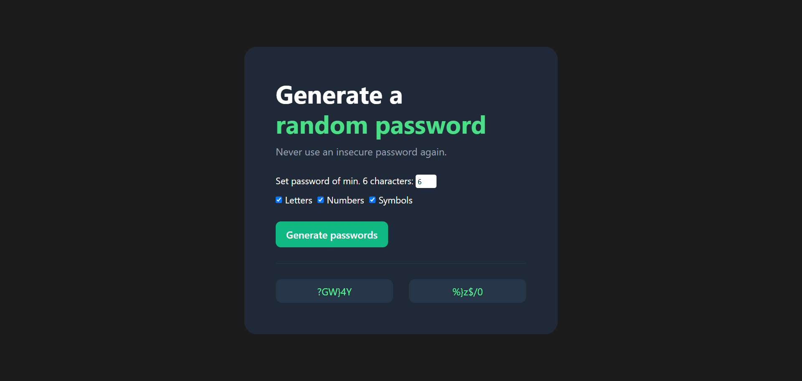

# 🔑 Password Generator

A solo project from the [Scrimba Frontend Developer Career Path](https://scrimba.com/frontend-path-c0j).  
This project is a **secure password generator** that allows users to quickly create strong, random passwords with customizable options. Users can set the password length, choose which character types to include, and copy generated passwords with a single click.

## 🛠️ Technologies
- HTML5  
- CSS3  
- JavaScript (ES6)

## 🚀 Features
- Generates **two random passwords** at a time.  
- Users can **set password length** (minimum 6 characters).  
- **Toggle options** to include/exclude:
  - Letters  
  - Numbers  
  - Symbols  
- **Click-to-copy** feature: click any password to automatically copy it to the clipboard.  
- Responsive and interactive UI.

## 🧠 What I Learned / Process
- Practiced **DOM manipulation** and event handling in JavaScript.  
- Learned how to **generate random values** from multiple character sets.  
- Implemented **Fisher-Yates shuffle** to ensure truly randomized passwords.  
- Added a **copy-to-clipboard feature** using the Clipboard API.  
- Designed a **responsive UI** that adapts to different screen sizes.

## 💡 Future Improvements
- Add a **password strength indicator**.  
- Allow **real-time password generation** as options are toggled.  
- Include **more customization options** (e.g., exclude similar characters).
- Add **dark/light mode toggle** for better UX.

## 🖼️ Preview

## 📚 Sources & References
- Scrimba course: [Scrimba Frontend Developer Career Path](https://scrimba.com/frontend-path-c0j)  
- Figma Design reference by Scrimba: [View Figma Design](https://www.figma.com/design/NEj9JDycMjF3XKXq7swoc9/Random-Password-Generator--New-version-?node-id=0-1&p=f&t=j7NYSBlJlm9mrjGj-0)
